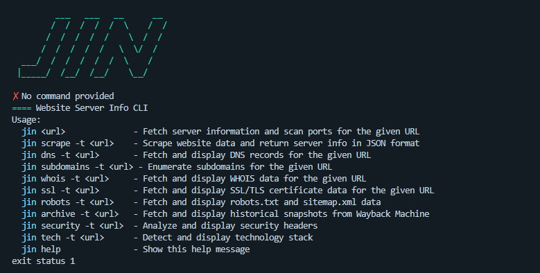

# Jin: Your OSINT & Recon CLI Toolkit



**Version: 1.0.0**

Jin is an open-source command-line interface (CLI) toolkit designed for OSINT (Open-Source Intelligence) and reconnaissance tasks. This project is an evolution of the original [aliftech/jin](https://github.com/aliftech/jin), which focused on ethical port scanning and DDoS attack simulation for educational purposes. Starting with version 1.0.0, Jin shifts its focus to ethical OSINT and recon activities, empowering users to gather information about targets securely and responsibly. This tool is intended for ethical and educational use only—please refrain from using it for harmful actions.

## Overview

Jin provides a suite of commands to assist with network reconnaissance, domain analysis, and vulnerability assessment. Built with Go, it is lightweight, portable, and containerizable with Docker, making it accessible for security researchers, students, and enthusiasts.

## Current Tools

- **server information**: Fetch server information and scan ports for the given URL.
- **scrape**: Scrape website data and return server info in JSON format.
- **dns**: Fetches and displays DNS records for a given domain.
- **subdomains**: Enumerates subdomains of a target domain.
- **whois**: Retrieves WHOIS data for domain registration information.
- **ssl**: Analyzes SSL/TLS certificate details.
- **robots**: Fetches and displays `robots.txt` and `sitemap.xml` data.
- **archive**: Retrieves historical snapshots from the Wayback Machine.
- **security**: Analyzes security headers of a target.
- **tech**: Detects and displays the technology stack of a website.

## Installation

### Prerequisites

- Go 1.24.4 or higher (for building from source)
- Docker (for containerized usage)

### From Source

1. Clone the repository:

   ```
   git clone https://github.com/aliftech/jin.git
   ```

2. Navigate to the project directory:

   ```
   cd jin
   ```

3. Build the binary:

   ```
   go build -o jin main.go
   ```

4. Run the CLI:
   ```
   ./jin
   ```

### Using Docker

1. Pull the latest image from Docker Hub (once pushed):

   ```
   docker pull wahyouka/jin:v1.0.0
   ```

2. Run the CLI interactively:

   ```
   docker run -it jin:1.24.5-alpine
   ```

3. (Optional) Build the image locally:
   ```
   docker build -t <yourusername>/jin:latest .
   docker push <yourusername>/jin:latest
   ```

## Usage

Run the CLI with the desired command and options:

```
./jin <command> [options] <url> [options]
```

Or, using Docker:

```
docker run -it <yourusername>/jin:latest <command> [options] <url> [options]
```

## Contributing

We welcome contributions! To contribute:

1. Fork the repository.
2. Create a feature branch: `git checkout -b feature-name`.
3. Commit changes: `git commit -m "Add feature-name"`.
4. Push to the branch: `git push origin feature-name`.
5. Submit a pull request.

## License

This project is licensed under the Apache 2.0 License. See the [LICENSE](LICENSE) file for details.

## Disclaimer

The tools in this project are intended for ethical and educational purposes only. Use them responsibly and avoid actions that could harm others or violate privacy laws.

## About

Jin is a reimagined version of the original [aliftech/jin](https://github.com/aliftech/jin), transitioning from ethical DDoS simulation to a comprehensive OSINT and recon toolkit. This shift reflects our commitment to supporting security research and education.
